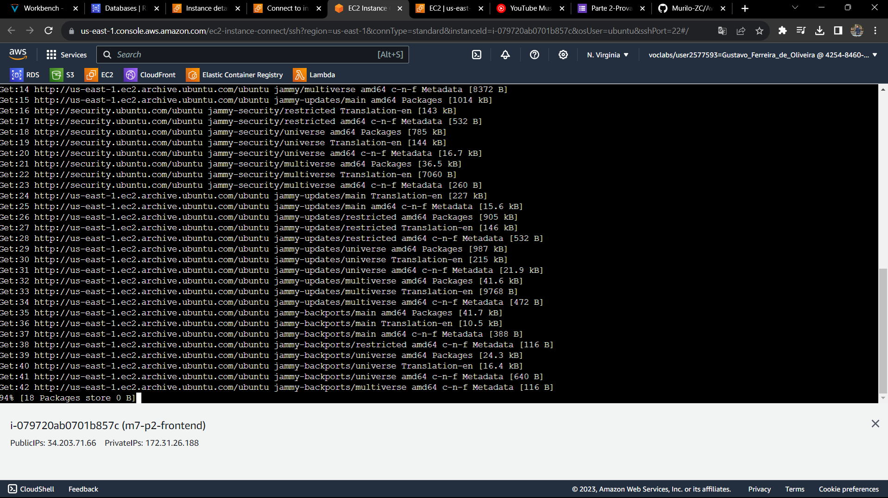

# M7-P2 - AWS

## Banco de dados

1. Dentro do RDS selecionei para criar uma nova base de dados - Botão grande e laranja no extermo direito
2. Selecioneio na tela de criação, comeicei selecionando o tipo do banco, no caso foi "Postgres"

   
3. Escolhi a opção free tier já que é só para a prova

   
4. Em settings, escolhi o nome do banco na aws `m7-p2-pratica` (e não o nome do database, dexei o por padrão mesmo), o acesso de usuario como username = `admin123` e a password= `admin123`

   
5. Marco a opção de acesso publico e crio um novo security group para o banco com o nome `sg-m7-p2`
   
6. As demais configurações deixo por padrão, já que não preciso altear muito por ser uma aplicação menor e clico em criar.

   
7. Por ultimo, no grupo de segurança, nas regras de entrada, eu retiro o ip da minha maquina, que por padrão a aws cria, ele não funciona que o ip de rede do inteli é dinamico.

   

   
8. Depois de criar, rodei a arquivo `criar_banco.py`, passando as credenciais de conexão:
   

## EC2 Front-end
1. Já na pagina de criação de EC2, ja começo configurando o nome `m7-p2-frontend` e tipo da imagem instancia `ubuntu`
   
3. Seleciono o tipo da instancia `t3.micro`, já que vou rodar uma imagem container posteriormente.
   
4. Crio um par de chave para a instancia, ao qual vou sar tanto na instancia do front, quanto do back.
   
5. Também crio um novo security group para a instancia, esse sg vou fazer de modo que sirva para o back e para o frontend. Além de aumentar o tamnho do volume de armazenamento da EC2 de 8 para 16 GB.
   
6. Por fim a pré-vizualização de configuração deve estar assim:

7. Por fim, temos que alocar um ip elastico para uma ec2, já que estamos no ambiente da academy e os endereços de EC2 mudam conforme ele se encerra. Não altero nenhuma configuração na pagina de alocar um endereço ip.
   
8. Após criar, clico em associar endereço, para linkar esse IP, a minha EC2.
   
9. Seleciono a minha instacia e as configurações devem ficar assim:

10. Clico em associar e devo obter sucesso nessa etapa, o quadro de status do IP deve mudar:

## EC2 Back-end

1. Para criar a instacia do Back-end, repeti o mesmo processo que fiz na hora de criar a instancia do Front-end

## Configurando as EC2
1. Dentro da minha instancia, vou clicar em conexão, já que optei por usar o terminal da web da aws

2. Clico em conectar:

3. No terminal, já tenho a chance de começar a configurar com os comandos `sudo apt-get update && sudo apt-get upgrade`
   
   

4. Instalando o docker no EC2 pelo documentação do docker `https://docs.docker.com/engine/install/ubuntu/`
   

## Vídeo Conclusão:

[Acesse aqui](https://drive.google.com/file/d/1ySjT6aDBkKIDl6HLtYKcWQg7QBkcK0mT/view?usp=drive_link)

## Para rodar o projeto
Na pasta raiz, rode o comando:
`Docker compose up`